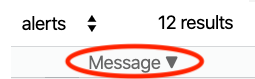

# vscode-codeql-starter for Adaptive Threat Modeling

You can set up this workspace in [Visual Studio Code](https://code.visualstudio.com) to get started with adaptive threat modeling.

**Note: Adaptive threat modeling is in beta and subject to change. It is currently only available for JavaScript and TypeScript code.**

## Prerequisites

1. Adaptive threat modeling requires a machine with a CPU with AVX (Advanced Vector Extensions).
    If you are not sure whether your CPU has AVX, check [this list](https://en.wikipedia.org/wiki/Advanced_Vector_Extensions#CPUs_with_AVX).
1. If you are running Windows, you may need to install the Microsoft Visual C++ 2019 Redistributable.

    1. Go to the [Visual Studio downloads](https://visualstudio.microsoft.com/downloads/).
    1. From the "All Downloads" section, select **Other Tools and Frameworks**.
    1. Select your CPU architecture (`x64`, `ARM64`, or `x86`), then press **Download**.
    1. Launch the installer and follow the steps as prompted.

    We found that this was not necessary for Windows 10 Pro during internal testing, however we have not tested other versions of Windows.
1. Install [Visual Studio Code](https://code.visualstudio.com) (VS Code).
1. Install the [CodeQL extension for Visual Studio Code](https://marketplace.visualstudio.com/items?itemName=github.vscode-codeql).
    Make sure that you have at least version 1.0.5 installed.

## Installing the CodeQL CLI for adaptive threat modeling

1. Install the adaptive threat modeling beta CodeQL CLI.
    - Download the `codeql-all.zip` file that you have been provided with.
      The link to download this file is included in the "Getting started" document pinned to the [#codeql-atm-beta](https://ghsecuritylab.slack.com/archives/C011BJD7279) channel on the GitHub Security Lab Slack instance.
    - If you use macOS Catalina, run `xattr -c codeql-all.zip` before extracting the zip file.
      For more information on installing on macOS Catalina, see "[Getting started with the CodeQL CLI](https://help.semmle.com/codeql/codeql-cli/procedures/get-started.html)."
    - Create a new directory named `codeql-cli-atm-home` where you can place the adaptive threat modeling beta CodeQL CLI.
      For example, `$HOME/codeql-cli-atm-home`
    - Extract `codeql-all.zip` into the `codeql-cli-atm-home` subdirectory you just created.
1. Check that the `codeql-cli-atm-home` directory has the following structure:

    ```
    codeql-cli-atm-home
    └── codeql
        ├── LICENSE.md
        ├── Open-Source-Notices
        ├── codeql
        ├── codeql.cmd
        ├── codeql.exe
        ├── cpp
        ├── csharp
        ├── go
        ├── java
        ├── javascript
        ├── legacy-upgrades
        ├── lib-extra
        ├── ml-models
        ├── python
        └── tools
    ```
1. Set the CodeQL CLI path setting in VS Code to the following path using the [Settings Editor](https://code.visualstudio.com/docs/getstarted/settings#_settings-editor):
    - For Windows, use `path/to/codeql-cli-atm-home/codeql/codeql.exe`
    - For other operating systems, use `path/to/codeql-cli-atm-home/codeql/codeql`

## Running a boosted security query in Visual Studio Code

1. Clone this repository to your computer and check out the `experimental/atm` branch.
    You can do this from a terminal by running `git clone --branch experimental/atm https://github.com/github/vscode-codeql-starter.git`.
1. Download the submodules by running `git submodule update --init --remote` from a terminal with a current working directory of the cloned repository.
1. In VS Code, click **File** > **Open Workspace**. Select the file `vscode-codeql-starter.code-workspace` in your checkout of this repository.
1. You will see several folders open in the left sidebar:
    - The `ql` folder contains the [open source CodeQL standard library](https://github.com/github/codeql/tree/experimental/atm) for JavaScript. It tracks the `experimental/atm` branch of the CodeQL repository. This folder contains [the boosted query for NoSQL injection](https://github.com/github/codeql/blob/experimental/atm/javascript/ql/src/experimental/adaptivethreatmodeling/NosqlInjectionATM.ql), which is located at `ql/javascript/ql/src/experimental/adaptivethreatmodeling/NosqlInjectionATM.ql`. You can also run the standard queries from here, and browse the libraries.
    - The `codeql-custom-queries-javascript` folder is ready for you to start developing your own custom queries for JavaScript, while using the standard libraries. There is an example query, `example.ql`, to get you started.
1. Open the boosted NoSQL injection query `NosqlInjectionATM.ql` in VS Code.
    This is located at `ql/javascript/ql/src/experimental/adaptivethreatmodeling/NosqlInjectionATM.ql`.
1. Select a database to run the query against using CodeQL for VS Code.
    An example database that demonstrates some of the potential vulnerabilities ATM can identify is provided in "[Creating a boosted security query](https://github.com/github/codeql/blob/experimental/atm/javascript/ql/src/experimental/adaptivethreatmodeling/docs/creating-a-boosted-query.md)."
    For more information, see "[Choosing a database](https://help.semmle.com/codeql/codeql-for-vscode/procedures/using-extension.html#choosing-a-database)" in the CodeQL for VS Code help.
1. Run the boosted query using CodeQL for VS Code.
    For more information, see "[Running a query](https://help.semmle.com/codeql/codeql-for-vscode/procedures/using-extension.html#running-a-query)" in the CodeQL for VS Code help.
1. Each result of the boosted query is scored, with higher scores more likely to be true positive results.
1. Sort the results of the boosted query such that the results with the highest scores appear first by pressing the "Message" table header until a downwards arrow appears like so:

    

## Creating your own boosted security queries

For information about writing new boosted queries, see the following:

- "[About adaptive threat modeling](https://github.com/github/codeql/blob/experimental/atm/javascript/ql/src/experimental/adaptivethreatmodeling/docs/about-adaptive-threat-modeling.md)"
- "[Creating a boosted security query](https://github.com/github/codeql/blob/experimental/atm/javascript/ql/src/experimental/adaptivethreatmodeling/docs/creating-a-boosted-query.md)"

## Updating the libraries for adaptive threat modeling

From time to time, we may release updates to the adaptive threat modeling libraries and queries.
To keep these up to date, run `git submodule update --remote` regularly.

## Support and feedback

We want to help you get the most from ATM, and also hear your feedback. For more information, see "[Support and feedback](https://github.com/github/codeql/blob/experimental/atm/javascript/ql/src/experimental/adaptivethreatmodeling/docs/support-and-feedback.md)."

## Contributing

This project welcomes contributions. For more information, see [CONTRIBUTING.md](CONTRIBUTING.md).

## License

This project is [licensed](LICENSE.md) under the MIT License. 

The CodeQL extension for Visual Studio Code is [licensed](https://github.com/github/vscode-codeql/blob/master/extensions/ql-vscode/LICENSE.md) under the MIT License. The version of CodeQL used by the CodeQL extension is subject to the [GitHub CodeQL Terms & Conditions](https://securitylab.github.com/tools/codeql/license).
